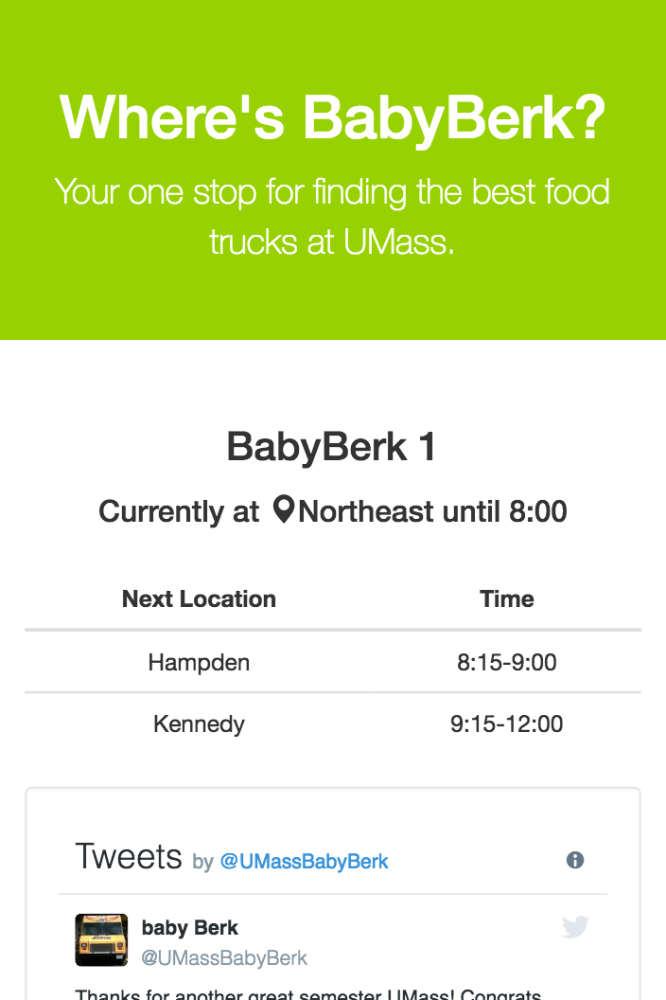

# Where's Baby Berk?

View live at [wheresbabyberk.com](http://www.wheresbabyberk.com).

A basic Node.js app using [Express 4](http://expressjs.com/) and [Heroku](https://www.heroku.com). This uses npm library [twitter](https://www.npmjs.com/package/twitter) to get tweets from @UMassBabyBerk and @UMassBabyBerk2, and uses npm library [natural](https://www.npmjs.com/package/natural) to interpret the tweets and match tweeted locations to known locations on the UMass Amherst campus. It checks every 5 minutes to update the displayed locations.

